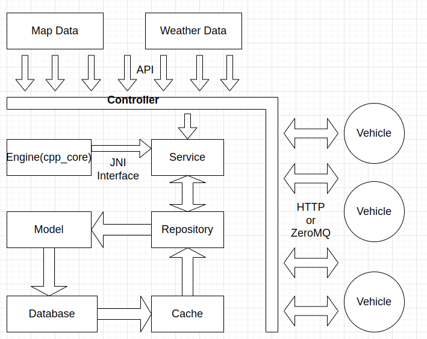

# Smart Autonomous Vehicle Management System



## Table of Contents
- [Installation](#installation)
  - [Prerequisites](#prerequisites)
  - [Building the Core Library](#building-the-core-library)
  - [Setting up the Frontend](#setting-up-the-frontend)
    - [Windows](#windows)
    - [Ubuntu](#ubuntu)
  - [Setting up the Backend](#setting-up-the-backend)
- [Usage](#usage)
- [Contributing](#contributing)
- [License](#license)

## Installation

This project uses C++ for core algorithms and high-performance computing, and Java for application layer development.

### Prerequisites

Before installation, ensure you have the following installed:

1. MySQL (Community Edition)
   - Download and install from: https://dev.mysql.com/downloads/
   - Set a password for the root user
   - For a demo, see: https://www.bilibili.com/video/BV1Kr4y1i7ru?p=3

2. Node.js
   - Download and install from: https://nodejs.org/
   - Verify installation with: `node -v` and `npm -v`

3. CMake
   - Download and install from: https://github.com/Kitware/CMake/releases/
   - Add CMake to the system PATH
   - For a demo, see: https://www.bilibili.com/video/BV1DV411k7PA?p=1

4. MinGW (for Windows)
   - Download and extract from: https://github.com/niXman/mingw-builds-binaries/releases/
   - Add to the system PATH: `#\mingw64\bin`
   - Verify installation with: `gcc -v`
   - For a demo, see: https://www.bilibili.com/video/BV1bC411474b/

### Building the Core Library

To build the core C++ library:

```bash
cd engine
mkdir build
cd build
cmake ..
make
```

This will generate a shared library named:
- `libdataprocessing.so` (Linux)
- `dataprocessing.dll` (Windows)
- `libdataprocessing.dylib` (Mac)

### Setting up the Frontend

#### Windows

1. Navigate to the `frontend` directory
2. If you encounter issues with vite, delete `package-lock.json` and reinstall dependencies:
   ```bash
   npm install
   ```
3. Run the development server:
   ```bash
   npm run dev
   ```

#### Ubuntu

1. Install nvm:
   ```bash
   curl -o- https://raw.githubusercontent.com/nvm-sh/nvm/v0.39.1/install.sh | bash
   ```

2. Reload the shell configuration:
   ```bash
   source ~/.bashrc
   ```

3. Install the latest LTS version of Node.js:
   ```bash
   nvm install --lts
   ```

4. Use the newly installed Node.js:
   ```bash
   nvm use --lts
   ```

5. Add Yarn's official repository and install the latest version:
   ```bash
   curl -sS https://dl.yarnpkg.com/debian/pubkey.gpg | sudo apt-key add -
   echo "deb https://dl.yarnpkg.com/debian/ stable main" | sudo tee /etc/apt/sources.list.d/yarn.list
   sudo apt update
   sudo apt install yarn
   ```

6. Navigate to the frontend directory and install dependencies:
   ```bash
   cd frontend
   yarn install
   ```

7. Run the development server:
   ```bash
   yarn dev
   ```

### Setting up the Backend

1. Navigate to the `engine` directory
2. Check the `CMakeLists.txt` file and ensure file directories are correct
3. Build the project:
   ```bash
   mkdir build
   cd build
   cmake -G "MinGW Makefiles" ..
   mingw32-make
   ```

## Usage

After installing all the necessary components:

1. Run the application's main function.
2. Start the frontend interface.
3. The system is now ready to accept network connections from client devices.

## Contributing

To contribute to this project:

1. Submit your code changes.
2. Create a pull request.
3. Wait for the review process to complete.

## License

This project is licensed under the Apache License, Version 2.0. You may obtain a copy of the License at:

http://www.apache.org/licenses/LICENSE-2.0

Unless required by applicable law or agreed to in writing, software distributed under the License is distributed on an "AS IS" BASIS, WITHOUT WARRANTIES OR CONDITIONS OF ANY KIND, either express or implied. See the License for the specific language governing permissions and limitations under the License.
