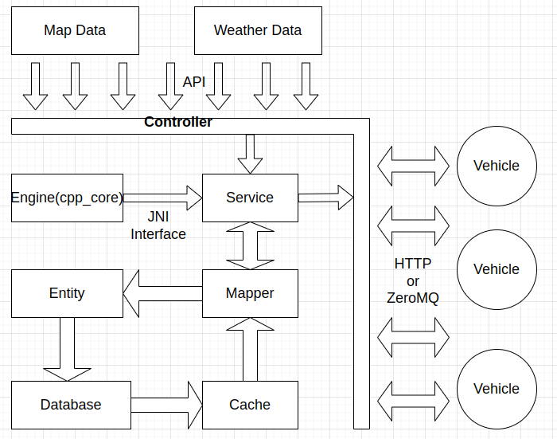
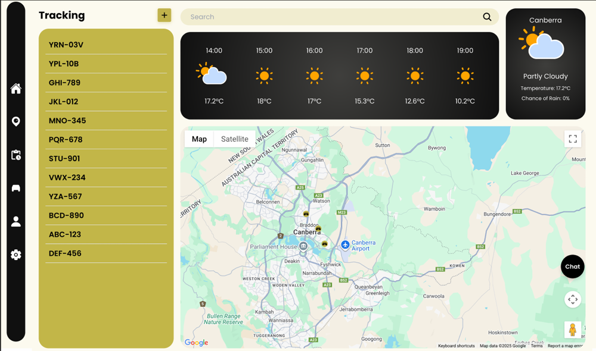
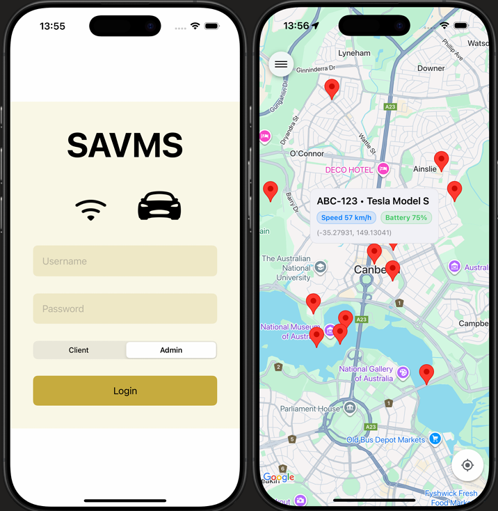
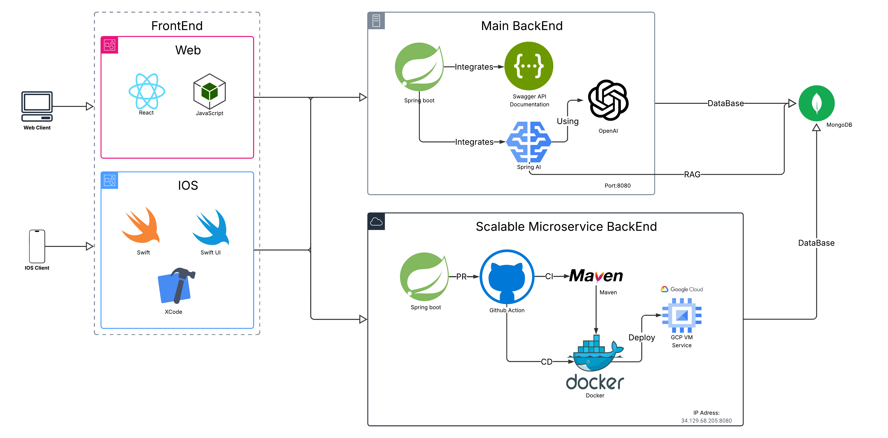

# Smart Autonomous Vehicle Management System



## Table of Contents
- [Overview](#overview)
- [Architecture](#architecture)
- [Project Structure](#project-structure)
- [Tech Stack](#tech-stack)
- [Quick Start](#quick-start)
- [Installation](#installation)
  - [Prerequisites](#prerequisites)
  - [Building the Core Library](#building-the-core-library)
  - [Setting up the Frontend](#setting-up-the-frontend)
    - [Windows](#windows)
    - [Ubuntu](#ubuntu)
  - [Setting up the Backend](#setting-up-the-backend)
- [Configuration](#configuration)
- [Backend Setup](#backend-setup)
- [Simulated Data](#simulated-data)
- [iOS App](#ios-app)
- [Usage](#usage)
- [Contributing](#contributing)
- [License](#license)

## Overview

Smart Autonomous Vehicle Management System (SAVMS) is an end-to-end platform for monitoring and managing connected/autonomous vehicles. It combines:
- High-performance computation engine (C++ with JNI bindings)
- Backend service (Java/Spring Boot + MySQL)
- Web frontend (monitoring UI with maps and alerts)
- iOS mobile app (native Swift)
- Data simulation and replay tools (Python)

This document preserves the original installation and usage guidance and expands it with a clearer structure and additional context for onboarding and collaboration.

## Architecture

SAVMS is composed of a native computation engine, a service layer, and user interfaces (web and mobile). The service layer invokes core algorithms via JNI and exposes APIs. Data is persisted in a relational database for query, visualization, and analysis.

Key layers and responsibilities:
- Engine (C++/JNI): computational tasks, data processing, algorithmic workloads
- Backend (Spring Boot): REST APIs, integration with engine, database access
- Frontend (Web): real-time visualization, maps, alerts, dashboards
- Mobile (iOS): on-the-go monitoring and operations

System overview (full architecture): see the image at the top (`arch/architecture.png`).

User interfaces and flow:

<p align="center">
  <em>Web UI — fleet map and status</em><br/>
  
</p>

<p align="center">
  <em>iOS App — mobile monitoring</em><br/>
  
</p>

<p align="center">
  <em>End-to-end data flow</em><br/>
  
</p>

## Project Structure

Selected directories:

```
engine/                # C++ engine (JNI). See engine/README.md
frontend/              # Web frontend (Vite/React)
src/main/java/         # Java backend (Spring Boot)
src/main/resources/    # Spring resources (application.yml, etc.)
simulate_data/         # Data simulators. See simulate_data/README.md
iOS_for_SAVMS/         # iOS app project (Xcode)
docs/                  # Documentation images (web.png, ios.png, flow.png)
arch/                  # Architecture diagrams (architecture.png)
VehicleSImulator/      # Vehicle simulator module (with README)
mydb.sql               # Example database script (if applicable)
pom.xml                # Maven project configuration
```

## Tech Stack

- Backend: Java 17+, Spring Boot, Maven, MySQL
- Engine: C++17, CMake, JNI (shared library)
- Frontend: Node.js, Vite, React (with Google Maps libraries)
- Mobile: iOS (Swift / Xcode)
- Tooling: Python (simulation), Git

## Quick Start

A minimal end-to-end setup; see platform specifics below:

1) Prepare the database (MySQL)
- Install MySQL, create the database and a user; if `mydb.sql` is available, import it for seed data:
  ```bash
  mysql -u <user> -p <db_name> < mydb.sql
  ```

2) Build and deploy the engine library (optional)
- Follow [Building the Core Library](#building-the-core-library) to produce the shared library and place it in a loadable location (see Configuration below).

3) Run the backend (Spring Boot)
- Configure DB connection in `src/main/resources/application.yml`;
- Start the app:
  ```bash
  mvn spring-boot:run
  ```

4) Run the frontend (dev mode)
- In `frontend/`, install dependencies and start dev server:
  ```bash
  npm install && npm run dev
  ```

5) Optional: start the data simulators
- See [Simulated Data](#simulated-data) for live/batch data generation to support integration testing.

## Installation

This project uses C++ for core algorithms and high-performance computing, and Java for application layer development.

### Prerequisites

Before installation, ensure you have the following installed:

1. MySQL (Community Edition)
   - Download and install from: https://dev.mysql.com/downloads/
   - Set a password for the root user
   - For a demo, see: https://www.bilibili.com/video/BV1Kr4y1i7ru?p=3

2. Node.js
   - Download and install from: https://nodejs.org/
   - Verify installation with: `node -v` and `npm -v`

3. CMake
   - Download and install from: https://github.com/Kitware/CMake/releases/
   - Add CMake to the system PATH
   - For a demo, see: https://www.bilibili.com/video/BV1DV411k7PA?p=1

4. MinGW (for Windows)
   - Download and extract from: https://github.com/niXman/mingw-builds-binaries/releases/
   - Add to the system PATH: `#\mingw64\bin`
   - Verify installation with: `gcc -v`
   - For a demo, see: https://www.bilibili.com/video/BV1bC411474b/

### Building the Core Library

To build the core C++ library:

```bash
cd engine
mkdir build
cd build
cmake ..
make
```

This will generate a shared library named:
- `libdataprocessing.so` (Linux)
- `libdataprocessing.dll` (Windows)
- `libdataprocessing.dylib` (Mac)

### Setting up the Frontend

#### Windows

1. Navigate to the `frontend` directory
2. If you encounter issues with vite, delete `package-lock.json` and reinstall dependencies:
   ```bash
   npm install
   ```
3. Run the development server:
   ```bash
   npm run dev
   ```

#### Ubuntu

1. Install nvm:
   ```bash
   curl -o- https://raw.githubusercontent.com/nvm-sh/nvm/v0.39.1/install.sh | bash
   ```

2. Reload the shell configuration:
   ```bash
   source ~/.bashrc
   ```

3. Install the latest LTS version of Node.js:
   ```bash
   nvm install --lts
   ```

4. Use the newly installed Node.js:
   ```bash
   nvm use --lts
   ```

5. Add Yarn's official repository and install the latest version:
   ```bash
   curl -sS https://dl.yarnpkg.com/debian/pubkey.gpg | sudo apt-key add -
   echo "deb https://dl.yarnpkg.com/debian/ stable main" | sudo tee /etc/apt/sources.list.d/yarn.list
   sudo apt update
   sudo apt install yarn
   ```

6. Navigate to the frontend directory and install dependencies:
   ```bash
   cd frontend
   yarn install
   ```

7. Run the development server:
   ```bash
   yarn dev
   ```

### Setting up the Backend

1. Navigate to the `engine` directory
2. Check the `CMakeLists.txt` file and ensure file directories are correct
3. Build the project:
   ```bash
   mkdir build
   cd build
   cmake -G "MinGW Makefiles" ..
   mingw32-make
   ```

## Configuration

Configure the database and engine library loading in:

- Database (Spring Boot): `src/main/resources/application.yml`
  - Common keys: `spring.datasource.url`, `spring.datasource.username`, `spring.datasource.password`

- Engine shared library (JNI): ensure the built artifact (`dataprocessing.dll` / `libdataprocessing.so`) is discoverable by the runtime:
  - Windows: place the `.dll` alongside the executable or add its directory to `PATH`
  - Linux/macOS: place in a system library directory or set `LD_LIBRARY_PATH` / `DYLD_LIBRARY_PATH`

Refer to `engine/README.md` for usage examples and JNI integration diagrams.

## Backend Setup

- Profiles
  - Env var: `SPRING_PROFILES_ACTIVE=dev`
  - Maven: `mvn spring-boot:run -Dspring-boot.run.profiles=dev`
  - JAR: `java -Dspring.profiles.active=prod -jar savms-app.jar`

- Ports
  - Default: `8080`
  - Override in `application.yml` via `server.port`, or at runtime with `-Dserver.port=8081` or `--server.port=8081`

- Health and diagnostics (if Spring Boot Actuator is enabled)
  - Health: `GET /actuator/health`
  - Info: `GET /actuator/info`
  - Liveness/Readiness (if configured): `GET /actuator/health/liveness`, `GET /actuator/health/readiness`

- API documentation (if OpenAPI/Swagger is enabled)
  - Swagger UI: typically `/swagger-ui.html` or `/swagger-ui/index.html`
  - OpenAPI JSON: `/v3/api-docs`

## Simulated Data

Python-based simulators help with local integration and regression testing (see `simulate_data/README.md` for full details). Quick start:

```bash
cd simulate_data
pip install watchdog

# Terminal A: start the data generator (rate/anomaly prob/speed multipliers supported)
python simulator_sender.py --rate 500 --anomaly-prob 5 --speed 1

# Terminal B: start the receiver (use --verbose for detailed output)
python simulator_receive.py -v
```

Data is emitted as JSON under `savms_data/` (including `live/` and batch directories) and can be consumed by the backend and frontend.

## iOS App

The iOS client resides in `iOS_for_SAVMS/`. Open the Xcode project to build and run. See the screenshots above for UI reference.

## Usage

After installing all the necessary components:

1. Run the application's main function.
2. Start the frontend interface.
3. The system is now ready to accept network connections from client devices.

## Contributing

To contribute to this project:

1. Submit your code changes.
2. Create a pull request.
3. Wait for the review process to complete.

## License

This project is licensed under the Apache License, Version 2.0. You may obtain a copy of the License at:

http://www.apache.org/licenses/LICENSE-2.0

Unless required by applicable law or agreed to in writing, software distributed under the License is distributed on an "AS IS" BASIS, WITHOUT WARRANTIES OR CONDITIONS OF ANY KIND, either express or implied. See the License for the specific language governing permissions and limitations under the License.
