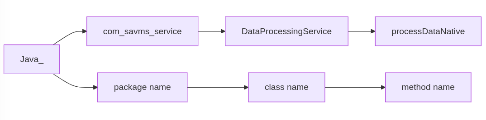

# JNI Name



# Data Flow


# Run in the engine directory:

```bash
mkdir build
cd build
cmake ..
make
```
This will generate a shared library named `libdataprocessing.so (Linux)` or `dataprocessing.dll (Windows)` or `libdataprocessing.dylib (Mac)`.

# How to use in Java

