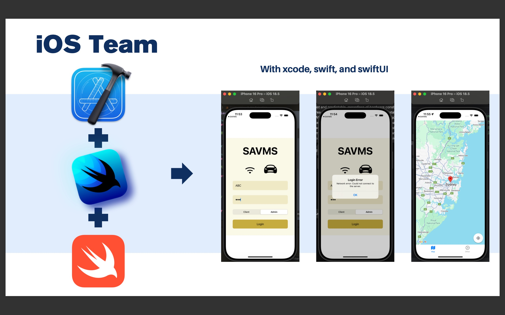

# MVVM Architecture Layers Explained

## 1. Model

- **Purpose**: Holds domain data and business logic.
- **Responsibilities**:
  - Represents entities such as `User`, `Task`, etc.
  - Manages data access and validation.
  - Performs CRUD operations (Create, Read, Update, Delete).
  - Handles decoding, encoding, and persistence.
- **Characteristics**:
  - Does not know about any UI or presentation logic.
- **Example**:

---

## 2. ViewModel

- **Purpose**: Acts as a bridge between the Model and the View.
- **Responsibilities**:
  - Exposes data in a form that's easy for UI consumption.
    - Examples: computed properties like `fullName`, formatted dates, filtered lists.
  - Handles user actions by calling Services or updating Models.
- **Characteristics**:
  - Typically implemented as a class conforming to `ObservableObject` with `@Published` properties.
  - Does not know specifics of the View implementation.
- **Example**:

---

## 3. Service Layer

- **Purpose**: Encapsulates external interactions.
- **Responsibilities**:
  - Handles network requests, database queries, authentication.
  - Integrates third-party SDKs.
- **Characteristics**:
  - Provides reusable logic shared across multiple ViewModels.
- **Example**:
